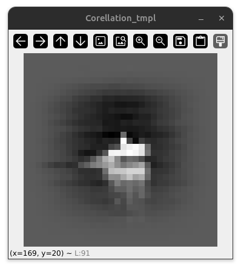

Median Flow scaler for Correlation tracker 
===================

Testimg app for checking Median Flow and Correlation trackers for their`s abilities and limitations

<h2 align="center">Demo</h2>

<figure align="center">
  
  <figcaption>Original video</figcaption>
</figure>

<figure align="center">
  
  <figcaption>Median Flow features</figcaption>
</figure>

<figure align="center">
  
  <figcaption>Corellation features</figcaption>
</figure>
